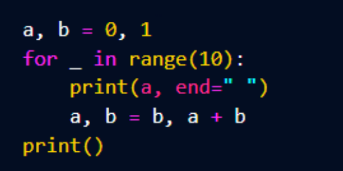

# Reto java 

En este repositorio se encuentra la solucion del primer reto de Java 
el cual contiene 4 ejercicios

De los cuales solo se solucionaron 3 de los 4 ejercicios: el **1**, el **2** y el **4**;

---

1. 
    Escribe un programa en Java que calcule la suma de todos los  números que son
    múltiplos de 3 0 5 y que sean menores que un número dado N. Además, excluye aquellos
    números que son múltiplos de ambos 3 y 5. Por ejemplo, si N es 10, los múltiplos de 3 0
    5 menores que 10 son 3, 5, 6 y 9, y la suma sería 23.

2.
    Escribe un programa en Java que valide una contraseña. La contraseña debe cumplir con
    las siguientes reglas:
    - Tener al menos 8 caracteres de longitud.
    - Contener al menos una letra mayúscula y una letra minúscula.
    - Contener al menos un número.
    - Contener al menos uno de los siguientes caracteres especiales: l, @, #, S, & *.

3.
    Escribe un programa que sea capaz de generar contraseñas de forma aleatoria. Podrás
    configurar generar contraseñas con los siguientes parámetros:
    - Longitud: Entre 8 y 16.
    - Con o sin letras mayúsculas.
    - Con o sin números.
    - Con o sin símbolos.
    (Pudiendo combinar todos estos parámetros entre ellos)

4. 
    A partir del siguiente código en Python, realiza una explicación del funcionamiento y una
    traducción al lenguaje Java,

    